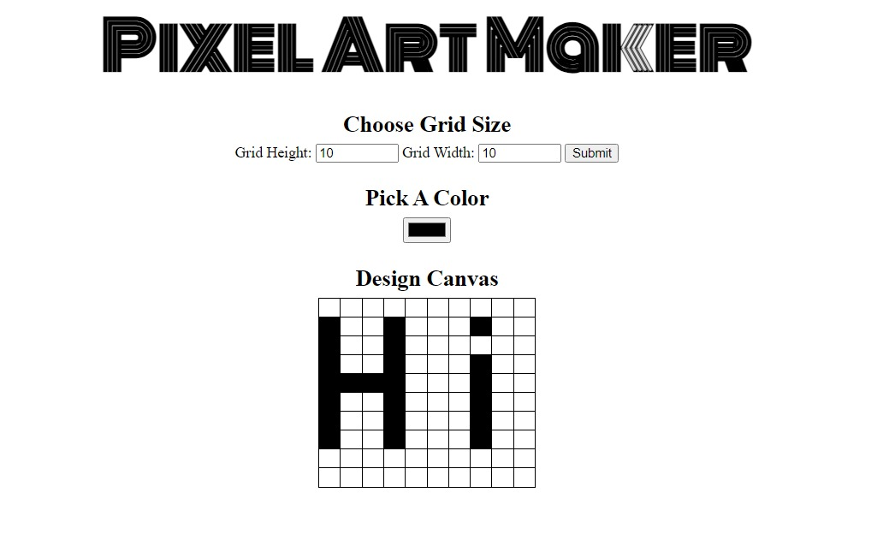

# Pixel Art Maker

A simple web app for creating pixel art.

Here's a screenshot of the Pixel Art Maker in action:

## Installation

To install and run the Pixel Art Maker, follow these steps:

1. Clone the repository.
2. Open `index.html` in your web browser.

## Usage

1. Choose the grid size using the form.
2. Pick a color.
3. Design your canvas by clicking on the cells.

...
